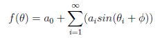
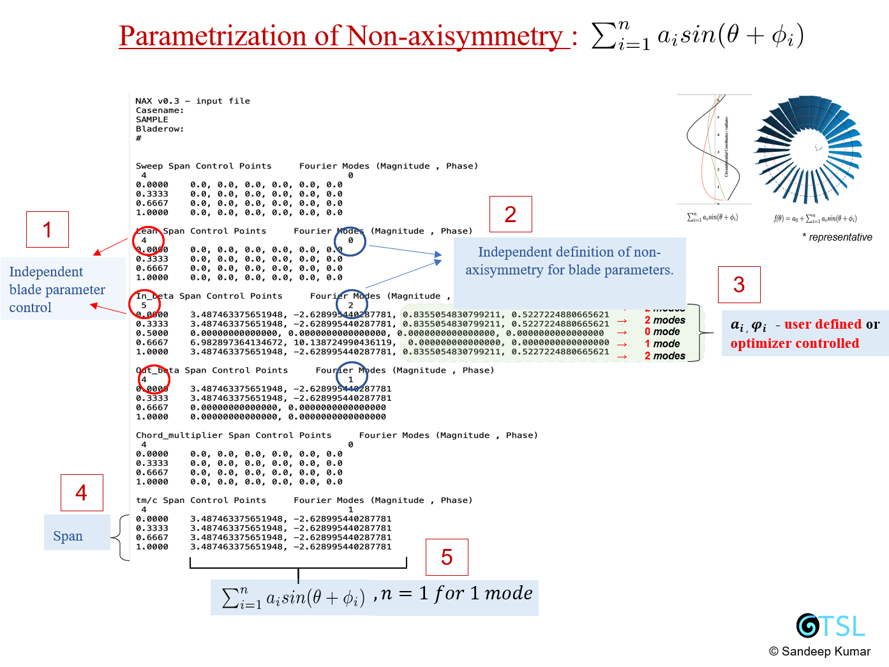

### NAX v0.3.1

(> NAX is currently under development for v1.0 - to be released soon !!! ) 

 For further details/ issues / latest capabilities please directly contact :: email Sandeep Kumar : kumarsp@mail.uc.edu )

#---------------      **N**on-**AX**isymmetric 3D blade design system      ---------------------------------------------------------#

NAX was first developed to design distortion tolerant propulsion systems for *Boundary Layer Ingestion* or *Turbo-Electic propulsion* configuarations as mentioned in NASA N+3 category.

> It was presented at ASME International Gas-Turbine Institute - Turbo Expo, Norway, 2018

**To cite this code:**

Kumar, Sandeep, Turner, Mark G., Siddappaji, Kiran, and Celestina, Mark. "Aerodynamic Design System for Non-Axisymmetric Boundary Layer Ingestion Fans." Proceedings of the ASME Turbo Expo 2018: Turbomachinery Technical Conference and Exposition. Volume 2C: Turbomachinery. Oslo, Norway. June 11–15, 2018. V02CT42A048. ASME. https://doi.org/10.1115/GT2018-77042

or see website : http://gtsl.ase.uc.edu/NAX/

**Known Applications**

1. NAX has been already used in design of 1.5 stage transonic BLI thruster design ( as in NASA N+3 configuration).
2. NAX is also being used for design of 1 stage Outlet Guide Vanes to reduce effect of couple effect on rotor.

#-------------------------------------------------------------------------------------#

 **How to run ** 

1. Use the executables specific to your OS.

2. Make sure you have permissions on your machine. Else for Unix\Linux user:  in "executables" directory -

chmod 777 .\tblade3 ( PRESS RETURN)

chmod 777 .\geomTurbo ( PRESS RETURN)

3. Make any "design-case" directory your working directory and run wrapper script from here - 

..\ .\ naxdesign.sh   ( PRESS RETURN)

In case of any issue: Please check the files in "inputs" directory for correctness and "scripts\geomTurbo_v0.3.py" for "n" blade row case. 

#--------------------------------------------------------------------------------------#

> NAX provides a unique design capability for development of **multi-row Axisymmetric and/or non-axisymmetric turbomachinery 3D blade** design and development. 

> It uses **harmonics content (Discrete Fourier Transforms) based design space to represent blade parameters in (R, THETA)** space . 
Following blade parameters **f(theta)**, can be used to create non-axisymmetry in 3D blade designs - 

*1. Inlet /exit blade metal angles,  
*2. Lean,  
*3. Sweep,  
*4. thickness,  
*5. chord length *

All these blade parameters can exhibit **non-axisymmetry in R , or (R,THETA )** direction for blade design. This non-axisymmetry can be assigned at used defined span location with magnitude, phase values for designing. 

> NAX is **highly paramteric and completely automated** in nature and can easily be integrated to Analysis(CFD) or/and Optimization process.

>The package comes with complete documentation and system requires Python v3x and Shell ( Unix environmemt). Windows OS users can use Cygwin. 

> The definition of non-axisymmetry is shown here using NAX-input file

