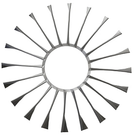

# NAX

(> NAX is currently under development for V1.0 - to be released soon !!! ) 

 For further details/ issues / latest capabilities please contact directly :: email Sandeep Kumar : kumarsp@mail.uc.edu )

#---------------      **N**on-**AX**isymmetric 3D blade design system      ---------------------------------------------------------#

NAX was first developed to design distortion tolerant propulsion systems for *Boundary Layer Ingestion* or *Turbo-Electic propulsion* configuarations as mentioned in NASA N+3 category.

> It was presented at ASME International Gas-Turbine Institute - Turbo Expo, Norway, 2018

**To cite this code:**
Kumar, S., Turner, M. G., Siddappaji, K., & Celestina, M. (2018, June). Aerodynamic Design System for Non-Axisymmetric Boundary Layer Ingestion Fans. In Turbo Expo: Power for Land, Sea, and Air (Vol. 51012, p. V02CT42A048). American Society of Mechanical Engineers.

or see website : http://gtsl.ase.uc.edu/NAX/

> so far NAX has been used in design of 1.5 stage transonic BLI thruster design.

#----------------------------------------------------------------------------------------------------------------------------------#

> NAX provides a unique design capability for development of **multi-row Axisymmetric and/or non-axisymmetric turbomachinery 3D blade** design and development. 

> It uses **harmonics content (Discrete Fourier Transforms) based design space to represent blade parameters in **(R, THETA)** space . 
Following blade parameters can be used to create non-axisymmetry in 3D blade designs - 

*1. Inlet blade metal angles, 
*2. Lean,  
*3. Sweep,  
*4. thickness,  
*5. chord length *

All these blade parameters can exhibit **non-axisymmetry in R , or (R,THETA )** direction for blade design.

> NAX is **highly paramteric and completely automated** in nature and can easily be integrated to Analysis(CFD) or/and Optimization process.

>The package comes with complete documentation and system requires Python v3x and Shell ( Unix environmemt). Windows OS users can use Cygwin. 

